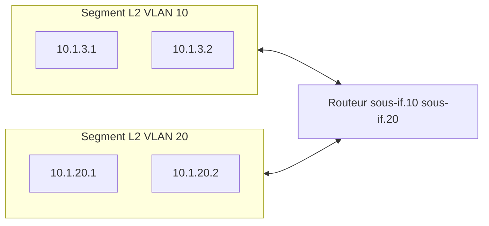
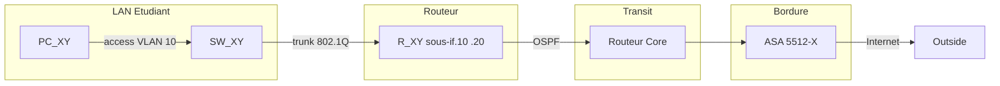

# Cours — Conception et urbanisation des services réseau

**Master 1 CNAM USCB1C — ESAIP**

Ce document présente les notions clés nécessaires pour comprendre et réaliser le TP de conception et déploiement d’une maquette réseau (équipements Cisco, services Linux). Chaque chapitre est relié aux sections correspondantes du TP (fichier `TP.md`, même répertoire) lorsque la notion y est mise en œuvre.

---

## 1. Introduction et objectifs du cours

### 1.1 Contexte et lien avec le TP

Le TP de ce module consiste à concevoir et déployer une maquette réseau complète : segmentation par VLAN (Data / Management), routage dynamique OSPF entre routeurs, pare-feu de bordure (ASA), et une stack de services sous Linux (Kea DHCP, Bind9 DNS, LLDAP, ProFTPD, Zabbix). Pour tirer pleinement parti du TP, il est indispensable de maîtriser les notions d’adressage IP, de VLAN et de tagging, le fonctionnement des cartes réseau des machines virtuelles, l’administration système et réseau sous Linux, ainsi que les protocoles des services déployés (DHCP, DNS, LDAP, FTP) et des protocoles de routage (OSPF). Ce cours fournit le socle théorique et pratique correspondant.

### 1.2 Objectifs pédagogiques

À l’issue du module, l’étudiant doit être capable de :

- Comprendre et appliquer un plan d’adressage IP (sous-réseaux, passerelles, CIDR).
- Différencier un réseau logique (L3) et un VLAN (L2), et configurer les ports en mode access ou trunk (cf. TP § III.1).
- Choisir le mode de connexion réseau des VMs (bridged, NAT, etc.) en fonction du contexte (cf. TP § IV.1).
- Utiliser les principales commandes système et réseau sous Linux pour déployer et diagnostiquer les services.
- Expliquer les échanges des protocoles DHCP, DNS, LDAP, SMTP, POP/IMAP et FTP.
- Comprendre la commutation L2, le routage statique et dynamique (RIP, OSPF, BGP) et les appliquer dans la maquette (OSPF sur les routeurs, cf. TP § III.2).
- Connaître les apports d’IPv6, les bases du monitoring (SNMP, Zabbix) et une introduction à la QoS et à la virtualisation des réseaux.

---

## 2. Notions d’adressage IP et réseaux

### 2.0 Couche 2 (L2) et couche 3 (L3) : de quoi parle-t-on ?

Pour bien comprendre la différence entre **réseau** (ou sous-réseau) et **VLAN**, il faut d’abord distinguer deux niveaux de fonctionnement du réseau :

- **Couche 2 (L2)** — liaison de données : on travaille avec des **adresses MAC** (identifiant physique d’une carte réseau) et des **switches**. Le switch apprend « cette adresse MAC est sur ce port » et transmet les trames en conséquence. La communication se fait à l’intérieur d’un même **segment** : tous les équipements qui reçoivent un même **broadcast** (trame envoyée à tous) forment un **domaine de broadcast** (L2).
- **Couche 3 (L3)** — réseau : on travaille avec des **adresses IP** et des **routeurs**. Le routeur lit l’adresse IP de destination, détermine dans quel **réseau** (préfixe) elle se trouve et envoie le paquet vers la bonne interface ou le bon prochain saut. La délimitation entre « ici » et « ailleurs » se fait par **adressage** (sous-réseaux) et **routage**.

**Analogie « immeuble à étages »** (une seule image pour L2 et L3) :

- Imaginez un **immeuble** (le switch) avec plusieurs **étages** (les VLANs). Chaque étage est isolé : un **cri** (broadcast) au 1er étage n’est pas entendu au 2e. Chaque étage = un **domaine de broadcast** (L2) = un segment logique. Les gens sont identifiés par leur **nom** (adresse MAC) et le concierge (le switch) sait « ce nom est sur quel port » — donc sur quel étage.
- L’**adresse IP** donne à la fois **l’étage** (le sous-réseau, ex. 10.1.3.0/24) et le **numéro de porte** (l’hôte dans ce sous-réseau). Pour envoyer un colis à un **autre étage** (autre sous-réseau), on passe par l’**ascenseur** (le routeur) : il a une « porte » sur chaque étage (une sous-interface par VLAN) et achemine le paquet au bon étage.

**En une phrase** : L2 répond à « qui est où physiquement sur le lien » (MAC, switch, domaine de broadcast = un étage) ; L3 répond à « dans quel réseau logique se trouve la destination » (IP, routeur = ascenseur entre étages).

### 2.1 Adressage IPv4

Une adresse IPv4 est codée sur 32 bits, généralement notée en notation décimale pointée (ex. `10.1.3.254`). Elle identifie une interface dans un **réseau logique** défini par un **masque de sous-réseau** (ou un préfixe CIDR).

**Sous-réseau et analogie de l’étage** : un **sous-réseau** (réseau L3) est l’ensemble des adresses IP qui partagent le **même préfixe** (ex. 10.1.3.0/24). Dans l’analogie de l’immeuble, c’est comme **un étage** : le préfixe identifie l’étage, la partie « hôte » est le numéro de porte sur cet étage. Les machines du même sous-réseau peuvent se joindre **directement en L2** si elles sont sur le même segment physique ou le même VLAN (le même « étage »). Pour atteindre un **autre étage** (autre sous-réseau), on passe par la **passerelle** (le routeur, l’« ascenseur »). Découper en sous-réseaux, c’est donc attribuer un étage (un plan d’adressage) à chaque segment logique ; chaque étage a sa passerelle. Dans le TP, par exemple, 10.X.Y.0/24 est l’« étage » Data par étudiant, avec la passerelle 10.X.Y.254 (cf. TP § II et III.2.1).

- **Masque** : séquence de bits à 1 pour la partie « réseau », à 0 pour la partie « hôte ». Ex. `255.255.255.0` signifie que les 24 premiers bits identifient le réseau.
- **CIDR** : notation `/n` où `n` est le nombre de bits du préfixe réseau. Ex. `10.1.3.0/24` désigne le réseau dont les adresses vont de `10.1.3.0` à `10.1.3.255`.
- **Adresse de réseau** : tous les bits hôte à 0 (ex. `10.1.3.0` pour un /24).
- **Adresse de broadcast** : tous les bits hôte à 1 (ex. `10.1.3.255` pour un /24). Les paquets envoyés à cette adresse sont reçus par tous les hôtes du sous-réseau.
- **Passerelle par défaut** : adresse du routeur permettant d’atteindre les autres réseaux (dans le TP, par ex. `10.X.Y.254` sur la sous-interface Data du routeur, cf. TP § II et III.2.1).

### 2.2 Réseau physique vs VLAN

**Même analogie « immeuble à étages »** (détail pour les VLANs) :

- Un **switch** = l’**immeuble** (une boîte physique avec des câbles).
- **Sans VLAN** : tout le monde est dans le **même grand espace** — un broadcast (un « cri ») est entendu par tous les équipements connectés au switch. Il n’y a qu’un seul **domaine de broadcast** (L2).
- **Avec VLANs** : l’immeuble a plusieurs **étages** (VLAN 10, VLAN 20, etc.). Un cri à l’étage 10 n’est pas entendu à l’étage 20. Chaque étage = un **domaine de broadcast** séparé = un **segment L2 logique** = un **VLAN**. Les trames sont **étiquetées** (tag 802.1Q) pour indiquer « cette trame va à l’étage 10 ». Le switch ne fait pas sortir un broadcast du VLAN 10 vers les ports du VLAN 20.

**Lien L2 / L3** : à chaque **étage** (VLAN) on attribue un **sous-réseau IP** (un plan d’adressage). Par exemple : VLAN 10 = étage Data, sous-réseau 10.1.3.0/24 ; VLAN 20 = étage Management, sous-réseau 10.1.20.0/24. Pour passer d’un étage à l’autre, il faut un **routeur** (l’« ascenseur ») qui a une porte sur chaque étage — d’où les sous-interfaces sur le routeur dans le TP (cf. TP § I, II et III.2.1). En pratique, on fait souvent correspondre **1 VLAN = 1 sous-réseau**.

**Résumé** : **VLAN** = découpage **L2** (un étage = qui entend les broadcasts) ; **sous-réseau** = découpage **L3** (quel plan d’adressage sur cet étage).

- **Réseau (au sens L3)** : ensemble d’adresses IP partageant le même préfixe et le même domaine de broadcast. La délimitation est logique (adressage) et passe par le routage.
- **VLAN (Virtual LAN)** : segment **couche 2** (L2) logique. Plusieurs VLANs peuvent coexister sur un même switch physique ; les trames sont isolées par identifiant VLAN (tag 802.1Q). Chaque VLAN constitue un domaine de broadcast séparé. On peut associer un sous-réseau IP différent par VLAN (comme dans le TP : VLAN 10 Data, VLAN 20 Management, cf. TP § I et II).

**Différence essentielle** : un « réseau » au sens courant peut désigner un sous-réseau IP (L3) ; un VLAN est une découpe L2. Plusieurs VLANs peuvent utiliser des plages d’adresses différentes (recommandé) ou, dans des cas particuliers, la même plage sur des VLANs distincts (isolation L2 garantit la séparation des flux).

**Schéma conceptuel** : même switch physique, deux segments L2 (VLANs), deux sous-réseaux L3 ; le routeur relie les deux via une sous-interface par VLAN.

### 2.3 Cas d’usage : réseaux distincts vs VLANs

**En résumé** : on crée des **sous-réseaux** pour séparer des groupes par **adressage** (routage) ; on crée des **VLANs** pour séparer des groupes sur le **même câblage** (isolation des broadcasts, sécurité L2).

- **Sous-réseaux (réseaux L3 distincts)** : lorsqu’on veut séparer des groupes d’hôtes par routage (ex. sites différents, séparation logique par fonction). Chaque sous-réseau a son propre préfixe et sa propre passerelle.
- **VLANs** : lorsqu’on veut segmenter le trafic au niveau L2 sur une même infrastructure physique (même câblage, même switch). Cas typiques : séparer Data et Management (comme dans le TP), isoler des services, limiter les domaines de broadcast. Les VLANs sont ensuite reliés au niveau L3 par un routeur (ou sous-interfaces sur un routeur, cf. TP § III.2.1).

### 2.4 Tagging 802.1Q : trunk et access

Le standard **802.1Q** ajoute un **tag** (identifiant VLAN, 12 bits) dans l’en-tête Ethernet pour indiquer à quel VLAN appartient la trame. En reprenant l’analogie de l’immeuble : le tag est l’**étiquette** qui indique « à quel étage (VLAN) » doit arriver la trame lorsqu’elle circule entre switchs ou entre le switch et le routeur.

- **Port en mode access** : un seul VLAN est associé au port. Les trames envoyées vers l’équipement connecté (ex. PC) sont **sans tag** ; le switch ajoute le VLAN à l’entrée et retire le tag à la sortie. Utilisé pour connecter un poste de travail ou un serveur qui ne gère pas le tagging (cf. TP § III.1.4 : port du PC en access VLAN 20).
- **Port en mode trunk** : transporte **plusieurs VLANs** ; les trames sont **tagguées** (sauf éventuellement un VLAN natif). Utilisé entre deux équipements qui comprennent le 802.1Q (switch–switch ou switch–routeur). Dans le TP, le lien entre le switch étudiant et le routeur est en trunk avec les VLANs 10 et 20 (cf. TP § III.1.5).

Résumé : **access** = un VLAN, pas de tag visible côté client ; **trunk** = plusieurs VLANs, trames tagguées.

### 2.5 Sous-interfaces sur routeur (encapsulation dot1Q)

Pour router entre VLANs, le routeur doit avoir une interface (ou une adresse) par VLAN. Sur une interface physique unique connectée en trunk au switch, on définit des **sous-interfaces** avec encapsulation **802.1Q** : chaque sous-interface est associée à un VLAN et reçoit une adresse IP du sous-réseau correspondant. Ainsi, le routeur joue de « passerelle » pour chaque VLAN (cf. TP § III.2.1 : `G0/0.10` pour le VLAN 10 Data, `G0/0.20` pour le VLAN 20 Management).

---

## 3. Cartes réseau des VMs (modes et contexte)

### 3.1 Modes principaux

Les hyperviseurs (VirtualBox, VMware, KVM, etc.) proposent plusieurs modes de connexion réseau pour les machines virtuelles :

- **Bridged (ponté)** : la VM est connectée directement sur le même segment L2 que l’interface physique (ou le port-group) de l’hôte. Elle reçoit une adresse du même sous-réseau que l’hôte (ou du VLAN configuré sur le port-group) et est vue comme une machine « à côté » de l’hôte.
- **NAT** : la VM accède à l’extérieur via une traduction d’adresse gérée par l’hyperviseur. Elle n’est en général pas joignable depuis le réseau physique ; utile pour avoir Internet sans exposer la VM.
- **Host-only** : la VM est sur un réseau virtuel interne à l’hôte ; elle peut communiquer avec l’hôte et les autres VMs sur ce réseau, mais pas avec le reste du réseau physique.
- **Réseau interne** : réseau virtuel partagé uniquement entre VMs ; pas d’accès à l’hôte ni au réseau physique.

### 3.2 Utilité et fonctionnement en contexte TP

Dans le TP, les VMs (dnsdhcp_XY, ftpldap_XY, zabbix_XY, client_XY) doivent être dans le **LAN Data** (VLAN 10, réseau `10.X.Y.0/24`) pour que les clients reçoivent le DHCP depuis Kea, résolvent les noms via Bind9, accèdent à FTP/LDAP et que Zabbix supervise les équipements. Le mode **bridged** (ou équivalent « réseau externe » pointant vers le VLAN Data) est donc adapté : la VM se comporte comme un hôte du même segment que le PC étudiant (cf. TP § IV.1 — « Carte réseau VM : mode bridged vers le VLAN Data »).

- **Bridged** : la VM utilise le même broadcast domain que l’interface choisie (ou le port-group avec le bon VLAN). Idéal pour intégrer les serveurs (Kea, Bind9, Zabbix, ProFTPD/LLDAP) et le client dans le réseau du TP.
- **NAT** : utile pour des VMs de test qui n’ont pas besoin d’être joignables depuis le reste de la maquette.
- **Host-only** : utile pour des labs isolés (pas d’accès au switch/routeur physique).

### 3.3 Contexte TP et choix bridged

Le TP impose que les VMs soient sur le VLAN Data (10.X.Y.0/24) avec une passerelle 10.X.Y.254. En bridged vers le segment VLAN 10 du poste, les VMs reçoivent (ou se voient attribuer) des adresses de ce sous-réseau et peuvent communiquer avec le PC, le routeur (sous-interface Data) et entre elles. Kea peut recevoir les requêtes DHCP directement ; Bind9, Zabbix et ProFTPD sont accessibles depuis les clients (cf. TP § IV.1 et IV.2).

### 3.4 Limitations

- La connectivité dépend de la configuration du **port-group** (ou réseau virtuel) côté hyperviseur : si le VLAN Data est configuré sur un port-group, la carte en « bridged » ou « réseau externe » doit être attachée à ce port-group.
- Avec une seule carte en bridged sur le VLAN Data, les VMs n’ont **pas** d’accès direct au VLAN 20 (Management) ; pour y accéder, il faudrait une seconde interface (ou un trunk avec tagging, si l’OS et l’hyperviseur le gèrent).
- En environnement partagé (salle de TP), les conflits d’adresses sont évités en utilisant les variables X et Y et en réservant des plages dédiées (cf. plan d’adressage du TP § II).

---

## 4. Bases de l’administration système et réseau sous UNIX/Linux

### 4.1 Commandes système

- **Gestion des services (systemd)** :
  - `systemctl start <service>` : démarrer un service.
  - `systemctl stop <service>` : arrêter un service.
  - `systemctl restart <service>` : redémarrer.
  - `systemctl status <service>` : état (actif/inactif, derniers logs).
  - `systemctl reload <service>` : recharger la configuration sans interruption (quand le service le supporte, ex. Kea, Bind9).
  - `systemctl enable <service>` : activer au démarrage.

- **Logs** : `journalctl -u <service> -f` affiche les logs en temps réel du service (ex. `journalctl -u kea-dhcp4-server -f` pour déboguer le DHCP, cf. TP § IV.2).

- **Paquets (Debian/Ubuntu)** : `apt update`, `apt install <paquet>`, `apt upgrade`. Les services du TP (Kea, Bind9, LLDAP, ProFTPD, Zabbix agent) s’installent via `apt` (cf. TP § IV).

- **Configuration réseau** : sous Ubuntu 24.04, Netplan est utilisé (fichiers dans `/etc/netplan/`). Après modification, exécuter `netplan apply`. Pour forcer l’usage de l’adresse MAC comme identifiant DHCP (éviter les conflits de baux), on peut ajouter `dhcp-identifier: mac` dans la config Netplan (cf. TP fin § IV).

- **Identification** : `hostname`, `ip link`, `ip addr` pour les interfaces et adresses ; `uname -a` pour le noyau et la machine.

### 4.2 Commandes réseau

- **Interfaces et routage** :
  - `ip addr show` (ou `ip a`) : adresses IP des interfaces.
  - `ip route show` : table de routage.
  - `ip link set <if> up/down` : activer/désactiver une interface.

- **Connectivité et diagnostic** :
  - `ping <adresse>` : test ICMP (cf. tests TP V.2).
  - `traceroute <adresse>` ou `tracepath <adresse>` : chemin des paquets (saut par saut).

- **Ports et connexions** : `ss -tulnp` ou `netstat -tulnp` : sockets en écoute (TCP/UDP) et processus associés. Utile pour vérifier que Bind9 (53), Kea (67), ProFTPD (21), etc. écoutent bien.

- **DNS** : `dig @<serveur> <nom>` (ex. `dig @10.X.Y.1 srv.x.lab.local`), `nslookup` ; `dig -x <ip>` pour la résolution inverse (cf. TP § IV.3 et V.3).

- **Capture et tests** : `tcpdump -i <interface>` pour analyser le trafic ; `nc` (netcat) pour tester des ports ou des échanges bruts.

Ces commandes sont utilisées dans les procédures de test du TP (cf. TP § V.2 et V.3) : ping entre VLANs, vers Internet, tests DHCP/DNS/FTP, vérification des services.

### 4.3 Bonnes pratiques

- Sauvegarder les fichiers de configuration avant modification (`cp fichier fichier.bak`).
- Après changement de config d’un service, vérifier la syntaxe si l’outil le permet (ex. `kea-dhcp4 -t /etc/kea/kea-dhcp4.conf`, `named-checkconf`, `named-checkzone`) puis `systemctl reload` ou `restart`.
- Consulter les logs en cas d’erreur (`journalctl -u <service> -n 50` ou `-f` pour le suivi en direct).

---

## 5. Services et protocoles (avec trames d’échange)

### 5.1 DHCP (Dynamic Host Configuration Protocol)

**Rôle** : attribution automatique d’adresse IP, passerelle, serveurs DNS, nom de domaine, etc.

**Port** : UDP 67 (serveur), UDP 68 (client).

**Séquence d’échange type (DORA)** :

1. **Discover** (client → broadcast) : le client envoie un message DHCP Discover (option 53 = DHCP Discover) pour demander une configuration. Adresses source : 0.0.0.0 ; destination : 255.255.255.255 (ou relais). Champs importants : `chaddr` (adresse MAC du client), `xid` (identifiant de transaction).
2. **Offer** (serveur → client) : le serveur répond en broadcast (ou via le relais) avec une offre (option 53 = Offer). Champs : `yiaddr` (adresse IP proposée), options : **option 3** (routers / passerelle), **option 6** (domain-name-servers), **option 15** (domain-name), durée du bail.
3. **Request** (client → broadcast) : le client accepte l’offre et envoie un DHCP Request (option 53 = Request) en indiquant l’adresse du serveur et l’adresse demandée.
4. **Ack** (serveur → client) : le serveur confirme en envoyant DHCP Ack (option 53 = ACK) avec les mêmes paramètres. Le client configure alors son interface avec l’IP, la passerelle et le DNS.

Si le client et le serveur ne sont pas sur le même segment (ex. client dans un VLAN, serveur dans un autre), un **relais DHCP** (ip helper-address sur le routeur) reçoit les Discover/Request en broadcast et les transmet en unicast au serveur Kea ; les réponses repassent par le relais (cf. TP § IV.2 et III.2).

### 5.2 Pare-feu

**Rôle** : contrôler les flux entre zones (ex. inside / outside), appliquer des règles d’autorisation (ACL) et effectuer la traduction d’adresses (NAT).

- **Zones** : interfaces regroupées par niveau de confiance (ex. inside = 100, outside = 0 sur l’ASA). Par défaut, trafic autorisé du niveau élevé vers le niveau bas, refusé dans l’autre sens sauf règle explicite.
- **NAT (source)** : les adresses internes (ex. 10.X.0.0/16) sont traduites en une adresse publique (souvent l’interface outside) pour accéder à Internet. Dans le TP, configuration du type `nat (inside,outside) dynamic interface` (cf. TP § III.3.3).
- **ACL** : listes d’accès pour autoriser ou refuser des flux (IP, ports). Sur l’ASA, les ACL sont associées aux interfaces et au sens du trafic.

Les trames ne sont pas modifiées par un protocole unique : le pare-feu filtre et réécrit les en-têtes (adresses, ports) selon ses règles.

### 5.3 DNS (Domain Name System)

**Rôle** : résolution de noms de domaine en adresses IP (et inverse) par des requêtes/réponses standardisées.

**Port** : UDP 53 (TCP 53 pour les transferts de zone ou réponses longues).

**Types de requêtes courants** : **A** (nom → IPv4), **AAAA** (nom → IPv6), **PTR** (IP → nom, zone inverse), **NS** (serveur faisant autorité pour la zone).

**Résolution** :
- **Itérative** : le client interroge un serveur, qui répond avec une référence (NS + glue) vers un autre serveur ; le client interroge ce suivant, etc.
- **Récursive** : le client envoie une requête récursive au serveur ; le serveur effectue lui-même les requêtes successives et ne renvoie au client que la réponse finale (A, AAAA, etc.).

**Échange type (requête A)** :
1. Client → Serveur : requête DNS (query) : type A, nom demandé (ex. srv.x.lab.local).
2. Serveur → Client : réponse (response) : section Answer avec enregistrement(s) A (nom, TTL, adresse IP). Les sections Authority et Additional peuvent contenir des NS et des adresses (glue).

Dans le TP, Bind9 est configuré en serveur faisant autorité pour la zone `x.lab.local` et la zone inverse correspondante (cf. TP § IV.3).

### 5.4 LDAP (Lightweight Directory Access Protocol)

**Rôle** : annuaire (lecture/écriture d’attributs) et authentification centralisée (mots de passe, rôles).

**Port** : TCP 389 (LDAP), TCP 636 (LDAPS).

**Opérations principales** :
- **Bind** : authentification. Le client envoie un message Bind avec DN et mot de passe ; le serveur répond BindResponse (success ou erreur). Utilisé pour s’identifier avant les recherches (cf. ProFTPD qui fait un Bind pour vérifier l’utilisateur, TP § IV.5).
- **Search** : recherche d’entrées. Le client envoie SearchRequest (base DN, scope, filtre, attributs demandés). Le serveur renvoie une ou plusieurs SearchResultEntry puis SearchResultDone. Ex. filtre `(uid=utilisateur)` sous la base `ou=people,dc=x,dc=lab,dc=local`.

**Schéma simplifié** : arbre hiérarchique (DC, OU, CN, UID). LLDAP dans le TP expose cet annuaire pour ProFTPD (cf. TP § IV.4 et IV.5).

### 5.5 SMTP (Simple Mail Transfer Protocol)

**Rôle** : envoi du courrier électronique (client MTA ou MUA → serveur MTA).

**Port** : TCP 25 (souvent 587 avec STARTTLS pour la soumission).

**Séquence type** :
1. Connexion TCP du client au serveur.
2. Serveur → Client : `220` (bannière).
3. Client → Serveur : `EHLO <domaine>`.
4. Serveur → Client : `250` + liste d’extensions.
5. Client → Serveur : `MAIL FROM:<expéditeur>` → `250 OK`.
6. Client → Serveur : `RCPT TO:<destinataire>` → `250 OK` (éventuellement plusieurs RCPT TO).
7. Client → Serveur : `DATA` → `354` (envoyer le message).
8. Client → Serveur : corps du message, puis ligne contenant uniquement `.` → `250 OK`.
9. Client → Serveur : `QUIT` → `221` (fermeture).

Codes réponses : 2xx succès, 3xx en cours, 4xx/5xx erreur temporaire ou permanente.

### 5.6 POP (Post Office Protocol) et IMAP (Internet Message Access Protocol)

**Rôle** : réception du courrier (accès à la boîte aux lettres sur le serveur).

- **POP** (port 110, POP3S 995) : le client se connecte, s’authentifie (USER/PASS), récupère la liste (LIST), télécharge les messages (RETR). Les messages sont en général supprimés du serveur après téléchargement (ou conservés selon configuration). Modèle « téléchargement » : la boîte est gérée localement après réception.
- **IMAP** (port 143, IMAPS 993) : le client travaille directement sur la boîte côté serveur (dossiers, drapeaux, recherche). Authentification (LOGIN), sélection de boîte (SELECT), lecture (FETCH), copie/suppression (COPY, STORE + \Deleted). Modèle « accès distant » : la boîte reste sur le serveur.

**Échange type (POP)** : connexion → `+OK` ; `USER nom` → `+OK` ; `PASS motdepasse` → `+OK` ; `LIST` → liste des numéros et tailles ; `RETR n` → contenu du message n ; `QUIT` → déconnexion.

**Échange type (IMAP)** : connexion → `* OK` ; `LOGIN user pass` → `OK` ; `SELECT INBOX` → état de la boîte ; `FETCH 1 BODY[]` → contenu du message 1 ; `LOGOUT` → déconnexion.

### 5.7 FTP (File Transfer Protocol)

**Rôle** : transfert de fichiers entre client et serveur (upload/download).

**Ports** : TCP 21 (canal de **contrôle** : commandes et réponses), TCP 20 (canal de **données** en mode actif) ou port éphémère côté serveur en mode passif.

**Modes** :
- **Actif** : le serveur initie la connexion de données vers le client (port indiqué par le client via PORT). Souvent bloqué par les pare-feu côté client.
- **Passif (PASV)** : le client initie aussi la connexion de données ; le serveur indique l’IP et le port sur lequel il écoute. Plus adapté derrière un NAT/pare-feu (cf. TP § IV.5 : `PassivePorts 50000 50100` pour ProFTPD).

**Séquence type** :
1. Connexion TCP du client au serveur sur le port 21.
2. Serveur → Client : `220` (bannière).
3. Client → Serveur : `USER <nom>` → `331` (mot de passe requis).
4. Client → Serveur : `PASS <motdepasse>` → `230` (authentification réussie).
5. Client → Serveur : `PASV` → `227` (entrée en mode passif, IP et port pour la donnée).
6. Client ouvre une connexion TCP vers ce port pour les données.
7. Client → Serveur : `RETR <fichier>` ou `STOR <fichier>` → transfert sur le canal de données, puis `226` (transfert terminé).
8. Client → Serveur : `QUIT` → `221`.

**FTPS** : FTP sur TLS (chiffrement du canal de contrôle et éventuellement du canal de données). ProFTPD peut être configuré avec `TLSRequired on` (cf. TP § IV.5).

---

## 6. Commutation et routage

### 6.1 Rappels sur l’adressage IP et le routage

Un hôte envoie un paquet vers une destination IP. Si celle-ci appartient au même sous-réseau (même préfixe que l’interface source), le paquet est envoyé directement en L2 (résolution ARP puis envoi sur le lien). Sinon, le paquet est envoyé à la **passerelle par défaut** (routeur). Le **routeur** consulte sa **table de routage** : pour chaque préfixe de destination, une route indique l’interface de sortie et l’adresse du prochain saut (next hop). La route **0.0.0.0/0** (réseau par défaut) envoie tout le trafic non mieux connu vers la passerelle indiquée (ex. vers l’ASA ou l’ISP, cf. TP § III.3.2).

### 6.2 Commutation L2 et VLAN

Un **switch** travaille en couche 2 (Ethernet). Il maintient une **table d’adresses MAC** (MAC → port) : en recevant une trame, il apprend la MAC source et le port ; pour une MAC destination connue, il envoie la trame uniquement sur le port correspondant ; pour une MAC inconnue ou broadcast, il diffuse sur tous les ports du même **domaine de broadcast**. Un **VLAN** restreint ce domaine : les trames sont isolées par identifiant VLAN ; la diffusion (broadcast) ne sort que des ports du même VLAN. Les commandes typiques sur un switch Cisco pour vérifier la configuration sont `show vlan brief` (VLANs et ports en access) et `show interfaces trunk` (ports trunk et VLANs autorisés) — cf. TP § III.1 et V.1.

### 6.3 Routage statique

Les routes sont configurées manuellement sur le routeur. Sur Cisco : `ip route <réseau> <masque> <next-hop|interface>`. Une **route par défaut** : `ip route 0.0.0.0 0.0.0.0 <passerelle>`. Dans le TP, l’ASA possède une route par défaut vers l’ISP sur l’interface outside ; le routeur Core peut avoir une route par défaut vers l’ASA inside pour envoyer le trafic Internet (cf. TP § III.3.2).

### 6.4 Routage dynamique

#### RIP (Routing Information Protocol)

- **Principe** : protocole à vecteur de distances. Chaque routeur envoie périodiquement sa table de routage (ou ses réseaux connus) à ses voisins. La **métrique** est le nombre de sauts (hop count).
- **Limites** : maximum 15 sauts (16 = infini) ; convergence lente (boucles possibles, stabilisation après plusieurs annonces) ; pas d’équivalence de chemins dans les versions classiques. RIP est peu utilisé dans les grands réseaux mais simple pour des maquettes.

#### OSPF (Open Shortest Path First)

- **Principe** : protocole à état de liens (link-state). Chaque routeur diffuse l’état de ses liens (interfaces, coûts) ; tous les routeurs construisent une même topologie et calculent les plus courts chemins (algorithme de Dijkstra). Métrique = coût (généralement inverse du débit).
- **Voisinage** : sur un segment broadcast (ex. Ethernet), les routeurs s’adjacent via des messages Hello et élisent un **DR** (Designated Router) et un **BDR** (Backup DR) pour réduire le trafic de mise à jour.
- **Zones (areas)** : OSPF peut être découpé en zones. L’**area 0** (backbone) est obligatoire ; les autres zones sont connectées à l’area 0. Les **ABR** (Area Border Routers) relient les zones et peuvent faire du **résumé de routes** (summary LSA).
- **OSPF mono-aire** : toute la topologie est dans l’area 0 (cas du TP, cf. TP § III.2.3 : `network ... area 0` pour les réseaux Data, Mgmt et Transit).
- **OSPF multi-aires** : utile pour limiter la taille des bases de liens et les mises à jour ; les routes inter-aires passent par l’area 0 et les ABR.

#### BGP (Border Gateway Protocol)

- **Rôle** : routage **inter-domaines** (entre Autonomous Systems, AS). Utilisé entre opérateurs et entre un site et son fournisseur d’accès.
- **Sessions** : **eBGP** entre routeurs d’AS différents (souvent sur lien direct) ; **iBGP** entre routeurs du même AS (pour propager les routes externes à l’intérieur de l’AS).
- **Attributs principaux** : **AS_PATH** (liste des AS traversés), **NEXT_HOP** (prochain saut pour atteindre le préfixe). La décision de sélection des routes repose sur des politiques et la comparaison d’attributs (local preference, AS_PATH length, etc.). BGP n’est pas mis en œuvre dans le TP ; seule la compréhension conceptuelle est visée ici.

### 6.5 Schéma de la maquette TP (flux typique)

Chemin typique : PC (VLAN 10 Data) → switch (port access) → switch (port trunk) → routeur (sous-interfaces dot1Q) → routage OSPF vers le Core → ASA → Internet (cf. TP § I).

---

## 7. Apports du protocole IPv6

### 7.1 Différences avec IPv4

- **Taille d’adresse** : 128 bits (au lieu de 32), ce qui élimine la pénurie d’adresses et permet une attribution hiérarchique et des plages très grandes par site.
- **NAT** : en IPv6 pur, le NAT n’est plus nécessaire pour la seule raison d’économiser des adresses ; la traduction peut rester utilisée pour des besoins de masquage ou de transition, mais n’est pas un passage obligé.
- **ICMPv6** : rôle central pour la découverte de voisins (**ND — Neighbor Discovery**), la configuration automatique des adresses (**SLAAC — Stateless Address Autoconfiguration**), et la résolution des adresses (remplace ARP).
- **En-têtes** : en-tête de base IPv6 simplifié (champs fixes, pas de checksum sur l’en-tête), options portées dans des en-têtes d’extension ; traitement plus rapide par les routeurs.

### 7.2 Adressage IPv6

- **Notation** : groupes de 16 bits en hexadécimal, séparés par `:` (ex. `2001:db8::1`). La séquence `::` remplace une suite de zéros.
- **Types d’adresses** :
  - **Unicast global** : routable sur Internet (préfixe typiquement délégué par le FAI ou le RIR).
  - **Unicast link-local** : valable sur un seul lien (préfixe `fe80::/10`), utilisée pour la découverte de voisins et les protocoles de routage sur le lien.
  - **Multicast** : préfixe `ff00::/8`, utilisé pour des groupes (ex. tous les routeurs, tous les nœuds).
- **Préfixes** : on parle de /64 pour un sous-réseau (64 bits pour la partie hôte), /48 ou /56 pour un site.

### 7.3 Intérêt pour la conception

- **Plan d’adressage** : hiérarchie claire (délégation par FAI, par site, par VLAN), réduction des tables de routage par agrégation.
- **Services** : **DHCPv6** (étatful ou stateless) pour options complémentaires ; **DNS** avec enregistrements **AAAA** pour la résolution nom → IPv6 ; **SLAAC** pour une configuration minimale sans serveur DHCP.

Le TP actuel est en IPv4 ; ces notions permettent d’envisager une évolution du plan d’adressage et des services vers le double stack (IPv4 + IPv6) ou l’IPv6 seul.

---

## 8. Monitoring et supervision des réseaux

### 8.1 Protocole SNMP

**Rôle** : interrogation et surveillance des équipements réseau (routeurs, switchs, serveurs) via une base d’informations structurée (MIB).

- **Versions** :
  - **SNMP v1 / v2c** : communauté (chaîne de caractères) en clair pour l’authentification ; v2c ajoute des opérations en masse (GetBulk). Simple mais non sécurisé (cf. TP : communauté `TPpublic` en lecture seule sur les Cisco, cf. TP § IV.6.7).
  - **SNMP v3** : authentification (MD5/SHA) et chiffrement (DES/AES) ; utilisateurs et groupes. Recommandé en production.

- **MIB et OID** : la **MIB** (Management Information Base) décrit les variables accessibles ; chaque variable est identifiée par un **OID** (Object Identifier) hiérarchique (ex. interfaces, compteurs de trafic, état des liens).

- **Opérations** :
  - **Get** : lecture d’une variable.
  - **GetNext** : parcours séquentiel de la MIB.
  - **Set** : modification (si autorisée) d’une variable.
  - **Trap** (ou Notification) : envoi non sollicité du gestionnaire vers le superviseur (alerte, changement d’état).

Dans le TP, les routeurs et switchs Cisco sont configurés avec `snmp-server community TPpublic RO` ; Zabbix utilise un template SNMP pour collecter les métriques (cf. TP § IV.6.7 et V.3).

### 8.2 Outils : Nagios et Zabbix

- **Nagios** : superviseur basé sur des **plugins** qui exécutent des contrôles (ping, HTTP, SNMP, etc.) et renvoient un état (OK, Warning, Critical, Unknown). Configuration par hôtes et services ; alertes par notification (mail, script). Modèle « pull » : le serveur interroge les cibles.

- **Zabbix** : plateforme de supervision avec **agents** (installés sur les hôtes), **templates** (ensemble d’éléments, déclencheurs, graphiques) et **découverte** (découverte de réseaux, d’agents, de services). Support SNMP, agent Zabbix, JMX, etc. Dans le TP, une appliance Zabbix 7.4.6 est déployée (cf. TP § IV.6) ; les VMs Ubuntu ont l’agent Zabbix (zabbix-agent2) ; les équipements Cisco sont supervisés via SNMP. Les hôtes minimum à superviser sont R_XY, SW_XY, dnsdhcp_XY, ftpldap_XY, client_XY (cf. TP § IV.6.5 et V.3).

---

## 9. Introduction à la Qualité de Service (QoS) et à la virtualisation des réseaux

### 9.1 Qualité de Service (QoS)

**Objectifs** : maîtriser le **délai**, la **gigue** (variation du délai) et les **pertes** pour des flux sensibles (voix, vidéo, temps réel) ou critiques (contrôle industriel).

**Mécanismes de base** :
- **Classification** : identification des flux (par IP, port, DSCP, etc.) pour les traiter différemment.
- **Marquage** : attribution d’un niveau de priorité dans l’en-tête (ex. **DSCP** en IP, **CoS** dans le tag 802.1Q) pour que les équipements en aval puissent appliquer une politique sans re-classifier.
- **Files d’attente et prioritisation** : plusieurs files (ex. LLQ pour la voix, CBWFQ pour le reste) avec affectation de bande passante ou priorité stricte ; **ordonnancement** (scheduling) pour servir les files selon la politique.
- **Policing / Shaping** : limitation du débit (policing = rejet ou remarking au-delà d’un débit ; shaping = mise en file pour lisser les pics).

Ces notions sont utiles pour concevoir des réseaux garantissant des performances prévisibles ; le TP ne demande pas de configuration QoS détaillée sur Cisco.

### 9.2 Virtualisation des réseaux

- **SDN (Software-Defined Networking)** : séparation du **plan de contrôle** (décisions de routage, règles) et du **plan de données** (acheminement des paquets). Un contrôleur central (ou distribué) pilote les équipements (ex. via OpenFlow) et applique des politiques de façon programmatique. Permet une gestion centralisée, une réaction rapide aux événements et une évolution des services sans toucher à chaque boîtier.

- **Overlay** : réseau virtuel construit au-dessus du réseau physique (underlay). Les paquets sont encapsulés (ex. **VXLAN** : encapsulation Ethernet dans UDP) pour créer des segments logiques (réseaux locaux virtuels) indépendants de la topologie L2/L3 sous-jacente. Utile en datacenter et cloud pour multi-tenant et extension de VLANs.

- **NFV (Network Functions Virtualization)** : exécution de **fonctions réseau** (pare-feu, NAT, load balancer, routeur) dans des VMs ou conteneurs plutôt que sur du matériel dédié. La maquette du TP illustre en partie cette idée : les services (DNS, DHCP, FTP, annuaire, supervision) sont déployés sur des VMs Linux, ce qui correspond à une virtualisation de fonctions d’infrastructure.

---

## 10. Synthèse et lien avec le TP

### 10.1 Tableau récapitulatif : notion du cours → section(s) du TP

| Notion du cours | Section(s) du TP |
|-----------------|------------------|
| Adressage IP, masque, CIDR | II — Plan d’adressage |
| Réseau vs VLAN, tagging 802.1Q, access/trunk | III.1 — Switch 2960 (VLANs, access, trunk) |
| Sous-interfaces routeur (dot1Q) | III.2.1 — Routeur 2800 sous-interfaces |
| Mode bridged pour les VMs | IV.1 — Plan général (carte réseau VM) |
| Commandes système/réseau Linux | IV.2 à IV.6, V.2, V.3 — Déploiement et tests |
| DHCP (DORA), Kea | IV.2 — Kea DHCP ; III.2 — ip helper-address |
| DNS (zones, Bind9) | IV.3 — Bind9 |
| LDAP (Bind, Search), LLDAP | IV.4 — LLDAP ; IV.5 — ProFTPD auth LDAP |
| FTP / FTPS (ProFTPD) | IV.5 — ProFTPD |
| Pare-feu, NAT (ASA) | III.3 — ASA 5512-X |
| Commutation L2, VLAN (show vlan, trunk) | III.1 — Switch 2960 |
| Routage statique (Core, ASA) | III.3 — Route par défaut ASA |
| OSPF (mono-aire) | III.2.3 — Configuration OSPF routeur |
| SNMP, Zabbix | IV.6 — Zabbix ; IV.6.7 — SNMP Cisco |

